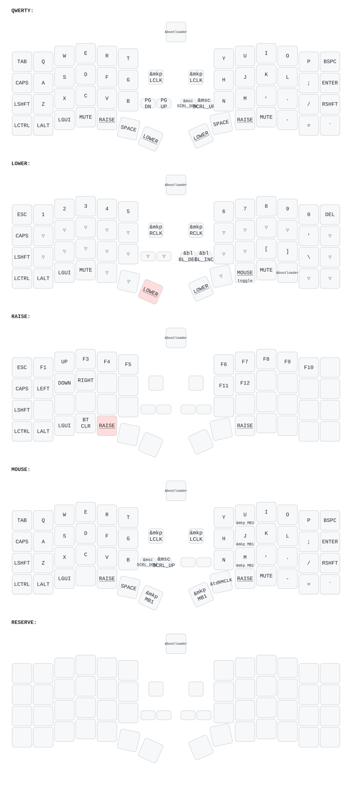

# KEYPOINT Macintosh Dongle ZMK Configuration

This repository contains the official ZMK board definitions, keymaps, and display shield configurations for the KEYPOINT USB Dongle + Split Keyboard.

# Keymap

---

## 🛠️ Architecture & Trackpad Scroll Notes

- **Board Targets**:
  - `keypoint_dongle`: Central Dongle firmware (`lpm_view` or `st7789_display`).
  - `keypoint_dongle_left`: Left Half Peripheral firmware (`left_bbtrackpad_keypoint`).
  - `keypoint_dongle_right`: Right Half Peripheral firmware (`right_trackpoint_keypoint`).
- **Matrix Offset**: The dongle keymap starts at index 0 (`RC(0,0)`) for the **Dongle Reset Button (`&BOT`)**. Left peripheral key matrix uses `col-offset = <1>` to map to indices 1–48.
- **Trackpad Scrolling**: The left half BlackBerry trackpad driver (`a320.c`) defaults to mouse wheel scroll mode (`CONFIG_A320_START_IN_SCROLL_MODE=y`) with 3x step scaling (`CONFIG_A320_SCROLL_SCALE_PERCENT=300`), forwarding scroll events via `split_inputs` to the Dongle.
